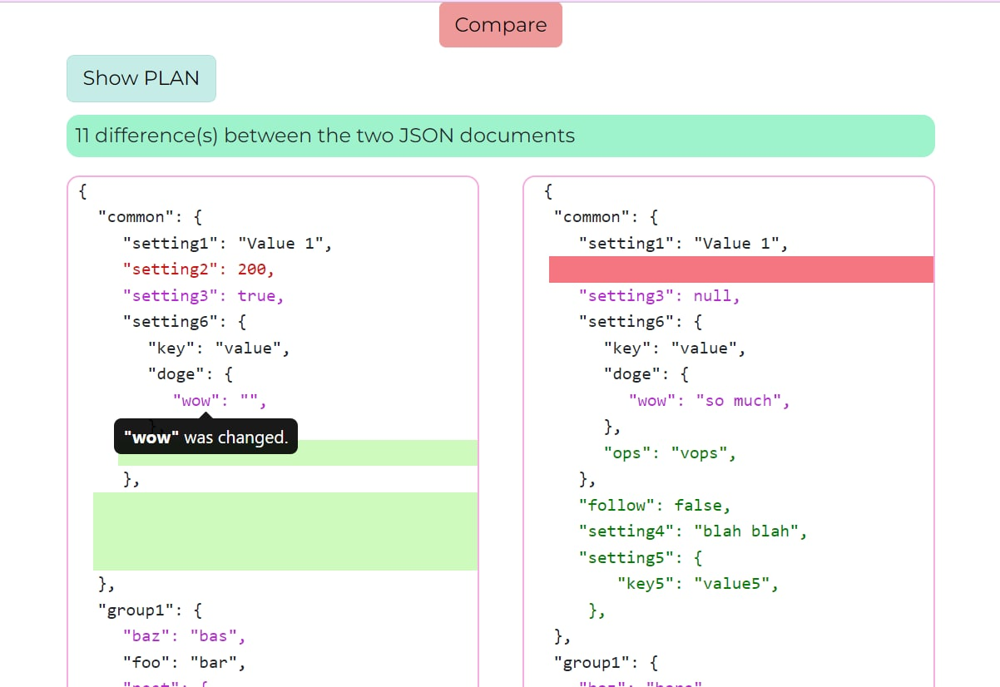
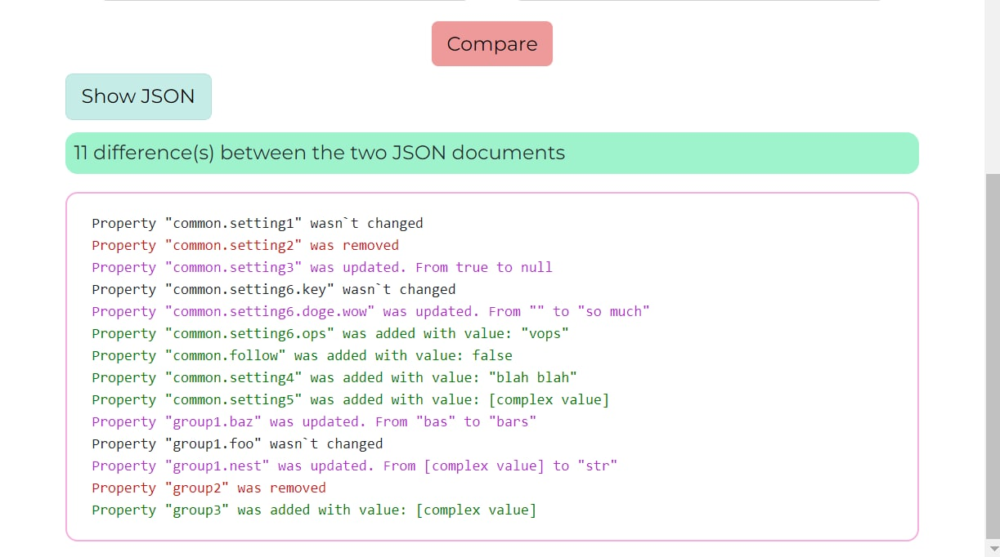

# JSON COMPARES
📎Program to compare JSON file.

Features:
1. Loading external files.

2. Сomparing two json files.

3. Get results in two formats

[**APP**](https://my-app-blinina.vercel.app/)

Stack: TypeScript, React, React-dropzone, React-hook-form, React-redux.

